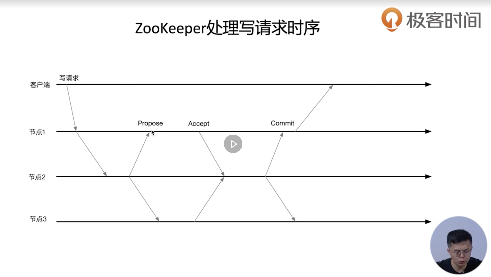

# Zookeeper运维

## 如何安装配置一个ZooKeeper生产环境

### 配置项

1. clientPort: ZooKeeper对客户端提供服务的端口号
2. dataDir: 用来保存快照文件的目录,如果没有设置dataLogDir,事务日志文件也会保存到该目录
3. dataLogDir: 用来保存事务日志文件的目录.在Zookeeper提交一个事务前,要保证事务日志记录的落盘,所以需要为dataLogDir分配独占的存储设备.

### ZooKeeper节点硬件要求

给ZooKeeper分配独占的服务器,要给ZooKeeper的事务日志分配独立存储设备

1. 内存:保存data-tree,8G就够了
2. CPU:不太消耗CPU,只要保证能够有一个独占CPU核即可,两核足以
3. 存储:写延迟会影响事务提交效率,建议为dataLogDir分配独立SSD存储

### 日志配置文件

使用log4j,不多说了

### 安装配置步骤

zkServer.sh start-foreground /Users/lacan/新世界/2-工具/4-工具安装文件/apache-zookeeper-3.5.6-bin/conf/zoo-quorum-node1.cfg

zkServer.sh start-foreground /Users/lacan/新世界/2-工具/4-工具安装文件/apache-zookeeper-3.5.6-bin/conf/zoo-quorum-node2.cfg

zkServer.sh start-foreground /Users/lacan/新世界/2-工具/4-工具安装文件/apache-zookeeper-3.5.6-bin/conf/zoo-quorum-node3.cfg

zkCli.sh -server '127.0.0.1:2181,127.0.0.1:2182,127.0.0.1:2183'

## 如何进行ZooKeeper的监控

### ZooKeeper四字命令

ruok/conf/stat/dump/wchc

### JMS(jconsole)

## 通过ZooKeeper Observer实现跨区域部署

### ZooKeeper如何实现写请求

#### 什么是Observer

##### 应用场景

参考配置文件`/Users/lacan/新世界/2-工具/4-工具安装文件/apache-zookeeper-3.5.6-bin/conf/zoo-quorum-node4.cfg`

1. Observer不参与提交和选举过程,可以通过Observer节点来提高整个集群读性能
2. 实现跨数据中心部署

## 通过动态配置实现不中断服务的集群成员变更

### 手动集群成员管理
